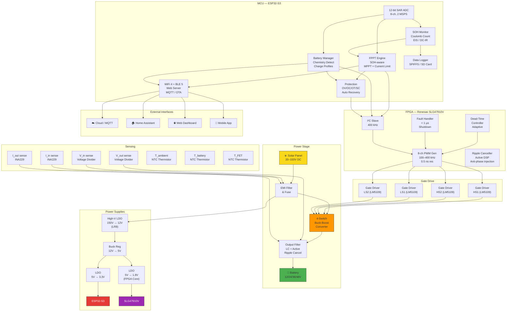

# SUNFLEX-HC System Architecture

## Block Diagram



---

## Component Interactions

### 1. Power Flow

```
Solar Panel → EMI Filter → Buck-Boost Converter → Output Filter → Battery
                 │                │                       │
            V_in, I_in       4× Gate Drive          V_out, I_out
            measured          (FPGA PWM)            measured
```

### 2. Control Flow

```
ESP32-S3 (100 Hz loop):
  │
  ├── Read V_in, I_in, V_out, I_out, Temperatures (ADC, 1 kHz oversampled)
  ├── Estimate Battery SOH (Coulomb counting + periodic DC-IR)
  ├── Run FPPT Algorithm:
  │     ├── Determine optimal operating point (P&O MPPT)
  │     ├── Apply SOH-based current limit
  │     └── Apply temperature derating
  ├── Send PWM parameters to FPGA via I²C:
  │     ├── Duty cycle (4-ch)
  │     ├── Dead time
  │     ├── Phase offset
  │     └── Switching frequency
  ├── Check protection limits
  └── Push telemetry via WiFi (MQTT / HTTP)

FPGA (real-time, hardware loop):
  │
  ├── Generate 8-ch phase-shifted PWM (100–400 kHz)
  ├── Monitor output ripple → inject anti-phase correction
  ├── Hardware fault detection (< 1 μs shutdown)
  └── Respond to I²C register writes from ESP32-S3
```

### 3. Data Flow

```
Sensors (5 kHz raw) → ESP32-S3 ADC
    │
    ├──→ 100 Hz: FPPT control loop
    ├──→ 1 Hz: SOH estimation update
    ├──→ 10 Hz: MQTT telemetry push
    ├──→ On-change: Protection events (immediate)
    └──→ 0.1 Hz: SPIFFS data logging

FPGA Status (via I²C, 100 Hz):
    ├──→ Fault flags
    ├──→ Ripple amplitude (RMS)
    ├──→ Current PWM parameters (readback verification)
    └──→ Die temperature
```

---

## Buck-Boost Topology Detail

### 4-Switch Non-Inverting Buck-Boost

```
          Q1 (HS Buck)         Q3 (HS Boost)
   Vin ───┬─────┬─── L1 ───┬─────┬────── Vout
          │     │          │     │
         Q2    D1          D2    Q4
       (LS Buck)              (LS Boost)
          │     │          │     │
         GND   GND        GND   GND

Buck Mode   (Vin > Vout): Q3 ON, Q4 OFF; Q1/Q2 switch
Boost Mode  (Vin < Vout): Q1 ON, Q2 OFF; Q3/Q4 switch
Buck-Boost  (Vin ≈ Vout): All 4 switches active (phase-shifted)
```

| Mode | Condition | Q1 | Q2 | Q3 | Q4 | Duty Control |
|------|-----------|:--:|:--:|:--:|:--:|-------------|
| **Buck** | Vin > Vout + 5V | PWM | Complementary | ON | OFF | D = Vout/Vin |
| **Boost** | Vin < Vout - 5V | ON | OFF | PWM | Complementary | D = 1 - Vin/Vout |
| **Buck-Boost** | \|Vin - Vout\| ≤ 5V | PWM_A | Complementary_A | PWM_B | Complementary_B | D_A, D_B coordinated |

**Transition hysteresis:** 5V to prevent oscillation between modes.

---

## FPGA Architecture (SLG47910V)

```
                    ┌───────────────────────────────────┐
                    │         SLG47910V GreenPAK          │
                    │                                     │
  I²C (from MCU) ──▶│  ┌─────────────┐                   │
                    │  │ I²C Slave   │                   │
                    │  │ Register    │                   │
                    │  │ File        │                   │
                    │  └──────┬──────┘                   │
                    │         │                           │
                    │  ┌──────▼──────────────────────┐   │
                    │  │ Configuration Manager        │   │
                    │  │ (atomic update, glitch-free) │   │
                    │  └──────┬──────────────────────┘   │
                    │         │                           │
                    │    ┌────▼─────┐  ┌───────────┐     │
                    │    │ PWM Gen  │  │ Dead-Time │     │
                    │    │ 8-ch     │◀─│ Insertion │     │
                    │    │ 0.5 ns   │  │ Adaptive  │     │
                    │    └────┬─────┘  └───────────┘     │
                    │         │                           │
                    │         ▼                           │
  Gate Drivers ◀────│  ┌──────────────┐                  │
                    │  │ Output Stage │                  │
                    │  └──────────────┘                  │
                    │                                     │
  ADC (Vout_ripple)─│──▶┌──────────────────┐             │
                    │   │ Ripple Canceller  │             │
  DAC (anti-phase) ◀│───│ (DSP Correlator)  │             │
                    │   └──────────────────┘             │
                    │                                     │
  Fault Inputs ─────│──▶┌──────────────────┐             │
                    │   │ Fault Handler    │             │
  Shutdown ◀────────│───│ (< 1 μs latch)   │             │
                    │   └──────────────────┘             │
                    └───────────────────────────────────┘
```

### Key FPGA Specifications

| Parameter | Value |
|-----------|-------|
| Device | Renesas SLG47910V |
| Logic Elements | 960 LUTs |
| Clock Frequency | 25 MHz (internal OSC) |
| PWM Resolution | 0.5 ns (using delay-line interpolation) |
| I²C Speed | 400 kHz (Fast Mode) |
| Fault Response | < 1 μs (hardware path) |

---

## ESP32-S3 Firmware Architecture

### Task Structure (FreeRTOS)

```
Priority (high → low):
  0 — Protection Task       (1 kHz, 2 KB stack)   — Hard real-time
  1 — ADC Sampling Task     (5 kHz, 4 KB stack)   — Hard real-time
  2 — FPPT Control Task     (100 Hz, 8 KB stack)  — Soft real-time
  3 — FPGA Communication    (100 Hz, 2 KB stack)  — Soft real-time
  4 — SOH Estimation Task   (1 Hz, 8 KB stack)    — Background
  5 — MQTT Telemetry Task   (10 Hz, 6 KB stack)   — Background
  6 — Web Server Task       (event-driven, 12 KB) — Background
  7 — OTA Update Task       (idle, 16 KB stack)   — On-demand
  8 — Data Logger Task      (0.1 Hz, 4 KB stack)  — Background
```

### Inter-Task Communication

- **Queues:** ADC data → FPPT engine; FPPT output → FPGA comm
- **Mutexes:** Shared config struct, WiFi credentials, calibration data
- **Event Groups:** Protection events, charging state changes, WiFi state
- **Task Notifications:** Lightweight wake-up between protection → FPPT → FPGA chain

---

## Protection System (Defense in Depth)

```
Layer 1: Hardware (FPGA, < 1 μs)
  ├── Over-current: Cycle-by-cycle current limit
  ├── Shoot-through: Dead-time enforcement
  └── Emergency shutdown: Latched fault signal

Layer 2: Firmware (ESP32-S3, < 1 ms)
  ├── Over-voltage: Input and output comparators
  ├── Over-temperature: FET and battery thermistors
  ├── Reverse polarity: MOSFET body diode + fuse
  └── Short-circuit: Current sense trip at 2× rated

Layer 3: Watchdog (external, 1.6 s)
  └── External WDT resets ESP32-S3 if firmware hangs
```

---

## Connectivity Architecture

```
SUNFLEX-HC
    │
    ├── WiFi STA Mode (default)
    │   ├── MQTT → Home Assistant (auto-discovery)
    │   ├── HTTP REST API (port 80)
    │   ├── WebSocket (real-time telemetry)
    │   └── OTA updates (port 3232)
    │
    ├── WiFi AP Mode (fallback)
    │   └── Captive portal for initial configuration
    │
    ├── BLE 5.0
    │   ├── GATT service for mobile app
    │   └── Provisioning (WiFi credentials)
    │
    └── USB-C (CDC Serial)
        ├── CLI for debugging
        └── Firmware flashing
```

---

## Memory Map (ESP32-S3)

| Region | Start | Size | Usage |
|--------|-------|------|-------|
| Internal SRAM | 0x3FCA_0000 | 512 KB | Runtime data, stacks |
| PSRAM (Octal) | 0x3C00_0000 | 8 MB | Web assets, buffers |
| Flash | 0x4200_0000 | 16 MB | Firmware, FPGA bitstream, SPIFFS |

**Flash Partition Table:**
```
# Name          Type    SubType   Offset     Size
nvs,            data,   nvs,      0x9000,    0x6000
otadata,        data,   ota,      0xF000,    0x2000
app0,           app,    ota_0,    0x10000,   0x300000
app1,           app,    ota_1,    0x310000,  0x300000
spiffs,         data,   spiffs,   0x610000,  0x200000
fpga_bitstream, data,   raw,      0x810000,  0x80000
```

---

## Signal List (ESP32-S3 ↔ FPGA ↔ Power Stage)

| Signal | Source | Destination | Type | Rate | Notes |
|--------|--------|-------------|------|------|-------|
| I²C SDA | ESP32-S3 | FPGA | Bidir | 400 kHz | Config + telemetry |
| I²C SCL | ESP32-S3 | FPGA | Output | 400 kHz | Clock |
| FAULT_n | FPGA | ESP32-S3 | Input | Async | Active low, interrupt |
| PWM[7:0] | FPGA | Gate Drivers | Output | 100–400 kHz | 8 independent channels |
| V_IN_ADC | Divider | ESP32-S3 ADC1_CH0 | Analog | 1 kHz | Input voltage |
| I_IN_ADC | INA229 | ESP32-S3 ADC1_CH1 | Analog | 1 kHz | Input current |
| V_OUT_ADC | Divider | ESP32-S3 ADC1_CH2 | Analog | 1 kHz | Output voltage |
| I_OUT_ADC | INA229 | ESP32-S3 ADC1_CH3 | Analog | 1 kHz | Output current |
| T_AMB_ADC | NTC | ESP32-S3 ADC1_CH4 | Analog | 10 Hz | Ambient temp |
| T_BAT_ADC | NTC | ESP32-S3 ADC1_CH5 | Analog | 10 Hz | Battery temp |
| T_FET_ADC | NTC | ESP32-S3 ADC1_CH6 | Analog | 10 Hz | FET temp |
| V_RIPPLE | Divider + AC-couple | FPGA ADC input | Analog | 1 MHz | Ripple sense |
| ANTI_PHASE | FPGA DAC | Output filter (injection FET) | Analog | 1 MHz | Ripple cancellation |

---

*Last updated: July 2025*
